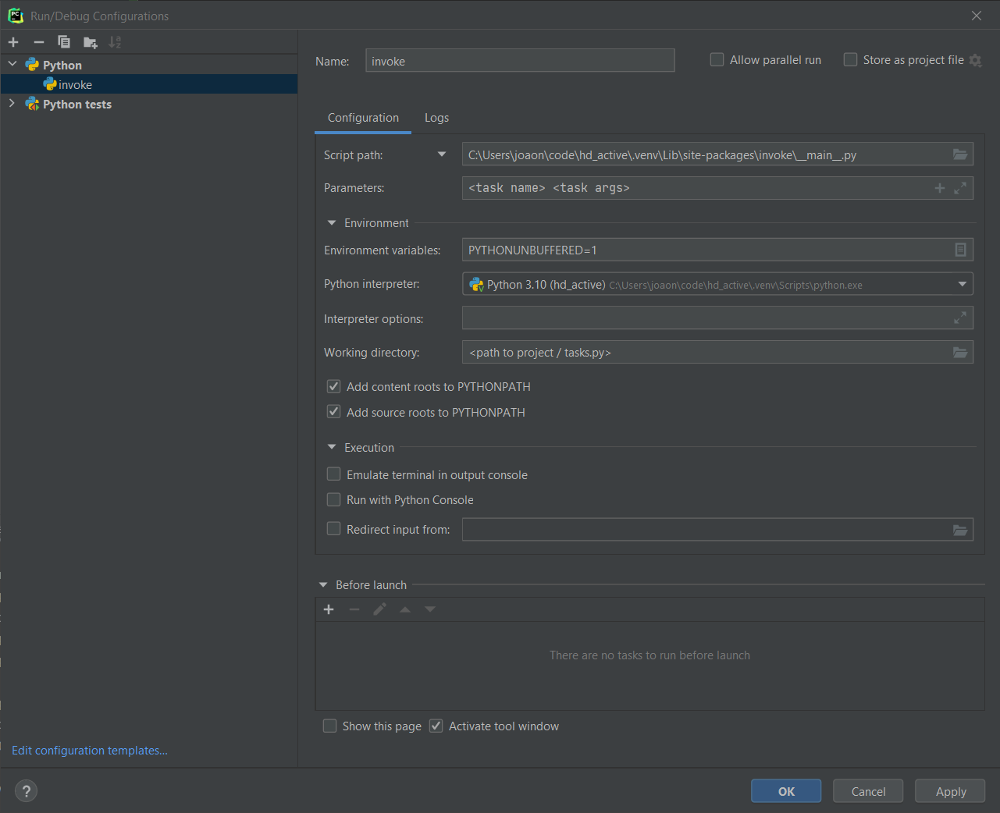

Python packages and other technologies used throughout this project.

## App

#### Semantic versioning
`semantic-version`:
[https://github.com/rbarrois/python-semanticversion](https://github.com/rbarrois/python-semanticversion)

#### YAML
`pyyaml`: [https://pyyaml.org](https://pyyaml.org/)

While this package is not included in the Python distribution, it's pretty standard when dealing
with YAML files.

In this project, there are three main reasons YAML is used instead of JSON:

* Comments.  
  YAML files can have comments, which can be very useful.
  ```yaml
  # Comment on a YAML file
  some_value: True  # Inline comments also supported
  ```
* Multiline.  
  YAML allows for multiline entries.
  ```yaml
  key_1: >
    This is a simple line.
    This multiline text will
    transform into a single line.
  key_2: |
    This is a simple line.
    This text will retain
    its original newlines.
  ```
* Legibility.  
  YAML is usually less verbose than JSON, making it more readable.

## Development

### Tasks
`pyinvoke`: [main page](https://www.pyinvoke.org/) | [docs](https://docs.pyinvoke.org/en/stable/) |
[GitHub](https://github.com/pyinvoke/invoke)

This project uses `pyinvoke` to facilitate executing miscellaneous tasks that help with development.

If you're familiar with `make` and `makefiles`, this does a similar thing, but all in Python.

#### Using invoke
After the installing the dev requirements (which include `invoke`), try the commands below.

List all available tasks:
```
inv --list
```

Tasks are grouped (those that have a `.`). To see all the _lint_ tasks:
```
inv --list lint
```

Help with a certain task:
```
inv --help pip.package
```

Use `--dry` to see what the task does without executing it.

#### Debugging tasks
To debug `tasks.py` (the file used by `invoke`), either add a `breakpoint()` statement or, if using
an IDE (in this example PyCharm), use the configuration below to allow setting breakpoints in the
code and debug `tasks.py` as any other Python file.



### Documentation
`mkdocs`: [https://www.mkdocs.org](https://www.mkdocs.org/)  
`mkdocs-material`: [https://squidfunk.github.io/mkdocs-material](https://squidfunk.github.io/mkdocs-material/)

_MkDocs_ generates a static website from MarkDown (`.mk`) files and the theme _Material_ adds a lot
of other functionality.

There are other packages (see `requirements-docs.in`) to enhance behavior and configuration is in
`mkdocs.yml`.

`inv --list docs` to get a list of tasks related to documentation.
